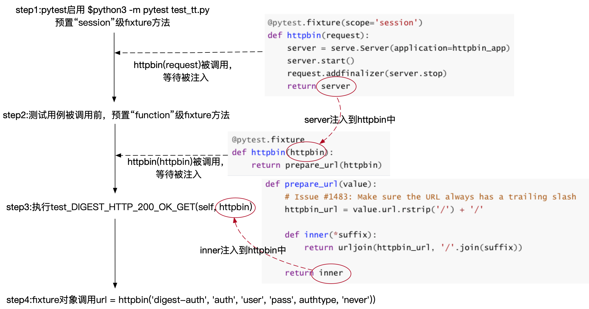
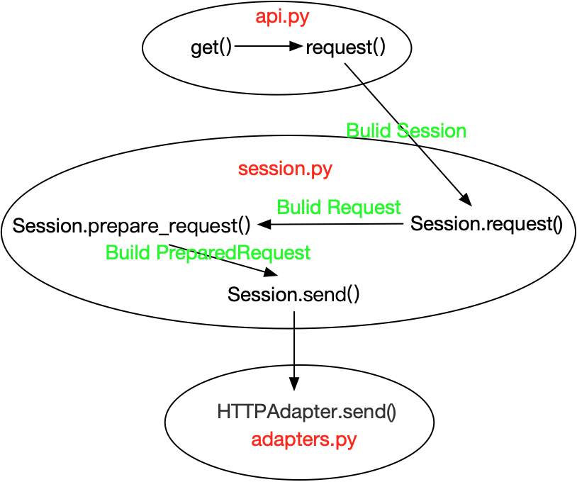

## -1-前言

在写这篇文章之前，看过一个老外写的关于requests源码的阅读，思路清晰，概念点到为止，不繁琐，觉得挺不错。想法有了，那就开始行动。

## -2-准备

因为习惯了终端的操作方式，所以近期我的代码编辑器一直是vim+插件，个人认为编辑器这块只要自己用的顺手就可以，只要满足以下几点即可：

- 代码补全功能
- 能实现代码的快速跳转及返回
- 快速浏览文件目录，关键字搜索
- 窗口分割，显示多页代码
- ...

源码下载：

```
$ git clone https://github.com/kennethreitz/requests
```

当前版本的requests测试例程是基于pytest开发的，如果我们想运行测试代码，就需要安装测试环境所需要的所有库。源码包中requirements.txt详细列出了所需安装的库，通过pip工具安装即可：

```
$ pip3 install -r requirement.txt
$ python3 -m pytest --version
This is pytest version 5.1.0, imported from /Library/Frameworks/Python.framework/Versions/3.6/lib/python3.6/site-packages/pytest.py
setuptools registered plugins:
pytest-httpbin-1.0.0 at /Library/Frameworks/Python.framework/Versions/3.6/lib/python3.6/site-packages/pytest_httpbin/plugin.py
```

然后我们写个简单的例程，看看requests是如何使用的：

```
>>> import requests
>>> r = requests.get('http://www.baidu.com')
>>> r.status_code
200
>>> r.headers['content-type']
'text/html'
>>> r.encoding
'ISO-8859-1'
>>> r.content
b'<!DOCTYPE html>...
```

## -3-代码分析

### step0确定方向

在我们分析requests源码之前，我们先理一下思路。因为requests发展至今已经提交了137个版本，功能越来越完善，代码也越来越复杂，如果一上来就准备将所有源码啃一遍，那么我想肯定坚持不了3天。所以我决定从简单的入手，触类旁通，逐步攻克目标。

接下去我们需要做的是打开README.md文件看看requests当前都支持哪些功能：

```
Feature Support
---------------
Requests is ready for today's web.

-   International Domains and URLs #国际化域名和URLS
-   Keep-Alive & Connection Pooling #keep—Alive&连接池
-   Sessions with Cookie Persistence #持久性cookie的会话
-   Browser-style SSL Verification #浏览器式SSL认证
-   Basic/Digest Authentication #基本/摘要认证
-   Elegant Key/Value Cookies #简明的key/value cookies
-   Automatic Decompression #自动解压缩
-   Automatic Content Decoding #自动内容解码
-   Unicode Response Bodies #Unicode响应体
-   Multipart File Uploads #文件分块上传
-   HTTP(S) Proxy Support #HTTP(S)代理支持
-   Connection Timeouts #连接超时
-   Streaming Downloads #数据流下载
-   `.netrc` Support #'.netrc'支持
-   Chunked Requests #Chunked请求
```

像我这样对http协议不是很熟悉，甚至都听不懂某些专有名词（也可能是我翻译有偏差），暂且先知道它有这么个东东，在后期使用的时候再深入研究，学以致用。

#### 从测试单元开始

了解了requests具备的基本功能后，就可以开始分析源码了。那么我们该从哪里开始？在源码目录下有一个tests文件夹，这里面以test开头的测试文件是专门用于测试requests接口：

```
$ ls
__init__.py   compat.py   pytestdebug.log   test_hooks.py   test_packages.py   test_structures.py 
testserver    utils.py		__pycache__       conftest.py     test_help.py       test_lowlevel.py  
test_requests.py   test_testserver.py   test_utils.py      
```

我们以test_requests.py作为切入点，并选择Basic/Digest Authentication相关内容。通过git grep命令搜索下测试文件test_requests.py关于Digest的内容：

```
$ git grep -n DIGEST tests/test_requests.py 
tests/test_requests.py:587:    def test_DIGEST_HTTP_200_OK_GET(self, httpbin):
tests/test_requests.py:605:    def test_DIGEST_AUTH_RETURNS_COOKIE(self, httpbin):
tests/test_requests.py:616:    def test_DIGEST_AUTH_SETS_SESSION_COOKIES(self, httpbin):
tests/test_requests.py:625:    def test_DIGEST_STREAM(self, httpbin):
tests/test_requests.py:637:    def test_DIGESTAUTH_WRONG_HTTP_401_GET(self, httpbin):
tests/test_requests.py:654:    def test_DIGESTAUTH_QUOTES_QOP_VALUE(self, httpbin):
```

我们选第一个方法分析，找到test_DIGEST_HTTP_200_OK_GET(self, httpbin)：

```
# test_requests.py
def test_DIGEST_HTTP_200_OK_GET(self, httpbin):

    for authtype in self.digest_auth_algo:
        auth = HTTPDigestAuth('user', 'pass')
        url = httpbin('digest-auth', 'auth', 'user', 'pass', authtype, 'never')
             
        r = requests.get(url, auth=auth)
        assert r.status_code == 200

        r = requests.get(url)
        assert r.status_code == 401
        print(r.headers['WWW-Authenticate'])
 
        s = requests.session()
        s.auth = HTTPDigestAuth('user', 'pass')
        r = s.get(url)
        assert r.status_code == 200
```

### step1源码概括

我们先大致了解一下这个测试用例的功能：

```
def test_DIGEST_HTTP_200_OK_GET(self, httpbin):
```

测试方法定义，传入参数为httpbin。

```
    for authtype in self.digest_auth_algo:
```

遍历不同的摘要认证算法。

```
        auth = HTTPDigestAuth('user', 'pass')
        url = httpbin('digest-auth', 'auth', 'user', 'pass', authtype, 'never')
```

摘要认证变量auth及url变量的设置。

```
        r = requests.get(url, auth=auth)
        assert r.status_code == 200
        
        r = requests.get(url)
        assert r.status_code == 401
        print(r.headers['WWW-Authenticate'])
```

对url发起get请求，200表示请求成功，401表示未经授权。这个测试是为了验证auth的必要性。

```
        s = requests.session()
        s.auth = HTTPDigestAuth('user', 'pass')
        r = s.get(url)
        assert r.status_code == 200
```
新建了一个会话对象s，同时也设置了auth变量，跟前面不同的是这个请求是由会话对象s发起的。

### step2源码分析

#### digest_auth_algo

```
# test_requests.py
def test_DIGEST_HTTP_200_OK_GET(self, httpbin):
    ...
    for authtype in self.digest_auth_algo:
    ...
      
--------------------------------------------------------------------------------------------

# test_requests.py
class TestRequests:
    digest_auth_algo = ('MD5', 'SHA-256', 'SHA-512')
    ...
```

在讲摘要认证算法之前先简单介绍一下摘要访问认证，它是一种协议规定的web服务器用来同网页浏览器进行认证信息协商的方法。浏览器在向服务器发送请求的过程中需要传递认证信息auth，auth经过摘要算法加密形成秘文，最后发送给服务器。服务器验证成功后返回“200”告知浏览器可以继续访问，若验证失败则返回"401"告诉浏览器禁止访问。

上文所说的摘要算法就是该代码实现的功能，当前该摘要算法分别选用了"MD5","SHA-256","SHA-512"。如果你想更深入了解，请参考[RFC 2069](https://tools.ietf.org/html/rfc206)。

#### HTTPDigestAuth

```
# test_requests.py
def test_DIGEST_HTTP_200_OK_GET(self, httpbin):
    ...				
        ...
        auth = HTTPDigestAuth('user', 'pass')
        ...
				
--------------------------------------------------------------------------------------------
        
# auth.py
class HTTPDigestAuth(AuthBase):
    """Attaches HTTP Digest Authentication to the given Request object."""

    def __init__(self, username, password):
        self.username = username
        self.password = password
        # Keep state in per-thread local storage
        self._thread_local = threading.local()

    def init_per_thread_state(self):
        # Ensure state is initialized just once per-thread
        ...
 
    ...
```

HTTPDigestAuth：为http请求对象提供摘要认证。实例化对象auth时需要传入认证所需的username及password。

threading.local()在这里的作用是保存一个全局变量，但是这个全局变量只能在当前线程才能访问，每一个线程都有单独的内存空间来保存这个变量，它们在逻辑上是隔离的，其他线程都无法访问。

我们可以通过实例演示一下摘要认证：

```
>>> import requests
>>> from requests.auth import HTTPDigestAuth
>>> r = requests.get('http://httpbin.org/digest-auth/auth/user/pass',auth=HTTPDigestAuth
('user','pass'))
>>> r.status_code
200
```

#### httpbin

```
# test_requests.py
def test_DIGEST_HTTP_200_OK_GET(self, httpbin):
    ...
        ...
        url = httpbin('digest-auth', 'auth', 'user', 'pass', authtype, 'never')
        ...
      
--------------------------------------------------------------------------------------------

# conftest.py
def prepare_url(value):
    # Issue #1483: Make sure the URL always has a trailing slash
    httpbin_url = value.url.rstrip('/') + '/'

    def inner(*suffix):
        return urljoin(httpbin_url, '/'.join(suffix))

    return inner

 
@pytest.fixture
def httpbin(httpbin):
    return prepare_url(httpbin)
```

第一次接触pytest这个模块，看了半天没明白是怎么用的，于是就网上查查查。

当我们调用pytest 测试test_requests.py文件时，文件中每一个test开头的方法都会被调用并执行，当然也包括test_DIGEST_HTTP_200_OK_GET(self, httpbin)这个方法。这时你会发现，这里出现了好多个httpbin，第一眼看

httpbin像一个方法，因为url=httpbin('digest-auth', 'auth', 'user', 'pass', authtype, 'never'),但是conftest.py中的 方法def htttpbin(httpbin)却只定义了一个参数，参数名也叫作httpbin…看到这里，我想此时的你也会跟我一样感到非常困惑。

好在pytest提供了一系列调试工具，我们可以利用它去调试下httpbin到底是什么东东。先将set_trace()方法插入到代码中，如下：

```
# test_requests.py
def test_DIGEST_HTTP_200_OK_GET(self, httpbin):
    ...
        ...
        url = httpbin('digest-auth', 'auth', 'user', 'pass', authtype, 'never')
        pytest.set_trace()  # debug
        ...
      
--------------------------------------------------------------------------------------------

# conftest.py
def prepare_url(value):
    # Issue #1483: Make sure the URL always has a trailing slash
    httpbin_url = value.url.rstrip('/') + '/'

    def inner(*suffix):
        return urljoin(httpbin_url, '/'.join(suffix))

    return inner


@pytest.fixture
def httpbin(httpbin):
    pytest.set_trace()  # debug
    return prepare_url(httpbin)
```

为了操作简单，这里我新建了测试文件test_tt.py，只调用了方法test_DIGEST_HTTP_200_OK_GET(self, httpbin)，调试信息如下：

```
$ python3 -m pytest test_tt.py 
===================== test session starts ======================
platform darwin -- Python 3.6.5, pytest-2.8.7, py-1.4.31, pluggy-0.3.1
rootdir: /Users/xmy/requests-2.22.0, inifile: pytest.ini
plugins: mock-0.11.0, httpbin-1.0.0, cov-2.2.1
collected 1 items 
test_tt.py 
=====================PDB set_trace (IO-capturing turned off) =====================
\> /Users/xmy/requests-2.22.0/tests/conftest.py(21)httpbin()
-> return prepare_url(httpbin)
(Pdb) httpbin  # debug
<pytest_httpbin.serve.Server object at 0x10a0744e0>  # httpbin return
(Pdb) c  # exit
===================== PDB set_trace (IO-capturing turned off)===================== 
\> /Users/xmy/requests-2.22.0/tests/test_tt.py(27)test_DIGEST_HTTP_200_OK_GET()
-> url = httpbin('digest-auth', 'auth', 'user', 'pass')
(Pdb) httpbin  # debug
<function prepare_url.<locals>.inner at 0x1096e7268>  # httpbin return
(Pdb) url  # debug
'http://127.0.0.1:62206/digest-auth/auth/user/pass'  # url return
(Pdb) c  # exit
127.0.0.1 - - [29/Aug/2019 15:41:16] "GET /digest-auth/auth/user/pass HTTP/1.1" 401 0
127.0.0.1 - - [29/Aug/2019 15:41:16] "GET /digest-auth/auth/user/pass HTTP/1.1" 200 46
127.0.0.1 - - [29/Aug/2019 15:41:16] "GET /digest-auth/auth/user/pass HTTP/1.1" 401 0
Digest realm="me@kennethreitz.com", nonce="46f593d6aedc8fe983c2430da4ddda3f", qop="auth", opaque="0512186cf2e776d90250d8558fd40e4a"
127.0.0.1 - - [29/Aug/2019 15:41:16] "GET /digest-auth/auth/user/pass HTTP/1.1" 401 0
127.0.0.1 - - [29/Aug/2019 15:41:16] "GET /digest-auth/auth/user/pass HTTP/1.1" 200 46
===================== 1 passed in 11.91 seconds =====================
```

在调试窗口PDB set_trace中可以看到，首先被调用的是的conftest.py中的httpbin()方法，我们在（pdb）中输入httpbin变量，结果返回了<pytest_httpbin.serve.Server object at 0x10a0744e0>。然后继续调用方法test_DIGEST_HTTP_200_OK_GET()，输入httpbin变量，结果返回了<function prepare_url.<locals>.inner at 0x1096e7268>。

经过调试后，httpbin的面貌渐渐变得清晰了：

- test_DIGEST_HTTP_200_OK_GET(self, httpbin)中的httpbin对象为<function prepare_url.<locals>.inner at 0x1096e7268>，也就是源码中prepare_url(value)方法里的inner(*suffix)方法。这里使用了函数闭包，有什么作用？我们后面讲。

- httpbin(httpbin)方法中参数httpbin对象为<pytest_httpbin.serve.Server object at 0x10a0744e0>，咦？pytest_httpbin是pytest的一个插件，那肯定跟pytest调用有关系了。然后Server是什么东东？我们来查看下它的源码：

  ```
  # serve.py
  ...
  from wsgiref.simple_server import WSGIServer, make_server, WSGIRequestHandler
  ...
  
  class Server(object):
      """
      HTTP server running a WSGI application in its own thread.
      """
      port_envvar = 'HTTPBIN_HTTP_PORT'
      
      def __init__(self, host='127.0.0.1', port=0, application=None, **kwargs):
          self.app = application
          if self.port_envvar in os.environ:
              port = int(os.environ[self.port_envvar])
          self._server = make_server(
              host,
              port,
              self.app,
              handler_class=Handler,
              **kwargs
          )
          self.host = self._server.server_address[0]
          self.port = self._server.server_address[1]
          self.protocol = 'http'
  
          self._thread = threading.Thread(
              name=self.__class__,
              target=self._server.serve_forever,
          )
      ...
      
      ...
      def start(self):                                                                                               
          self._thread.start()  
          ...
      
      ...    
      @property
      def url(self):
          return '{0}://{1}:{2}'.format(self.protocol, self.host, self.port)
          ...
  ```

  原来这是一个本地的WSGI服务器，专门用于pytest进行网络测试，这样的好处在于我们无需连接外部网络环境，在本地就能实现一系列的网络测试工作。

  WSGI全称是Web Server Gateway Interface,它其实是一个标准，介于web应用与web服务器之间。只要我们遵循WSGI接口标准设计web应用，就无需在意TCP连接，HTTP请求等等底层的实现，全权交由web服务器即可。

  上述代码实现的逻辑已经比较清晰了，httpbin对象被实例化的时候调用\_\_init\_\_(self, host='127.0.0.1', port=0, application=None, **kwargs)。

  - host主机号为本地回环地址”127.0.0.1“。
  - port端口号默认为0，最终由系统来确定port = int(os.environ[self.port_envvar])。
  - application就是前面所说的web应用，如果没有传入，默认为None。
  - self._server = make_server(host, port, self.app, handler_class=Handler, **kwargs)创建本地服务器。
  - self.\_thread = threading.Thread( name=self.\_\_class\_\_, target=self._server.serve_forever, )创建线程，开启http监听。

  start(self)方法的作用是启动线程。

  url(self)方法使用了装饰器@property，目的是将方法url(self)变成属性来调用，返回本地服务器地址

  "http://127.0.0.1:xxxx"

emmm...感觉讲了很多，可是还是没搞清楚pytest是如何工作的啊？接下来我们就来讲这块内容，在此之前，我们再贴一下前面的代码：

```
# test_requests.py
def test_DIGEST_HTTP_200_OK_GET(self, httpbin):
    ...
        ...
        url = httpbin('digest-auth', 'auth', 'user', 'pass', authtype, 'never')
        ...
      
--------------------------------------------------------------------------------------------

# conftest.py
def prepare_url(value):
    # Issue #1483: Make sure the URL always has a trailing slash
    httpbin_url = value.url.rstrip('/') + '/'

    def inner(*suffix):
        return urljoin(httpbin_url, '/'.join(suffix))

    return inner

 
@pytest.fixture
def httpbin(httpbin):
    return prepare_url(httpbin)
```

装饰器@pytest.fixture用于声明一个方法是fixture方法，如果测试用例的参数列表中包含fixture对象，那么测试用例运行之前会先调用fixture方法。fixture可以指定其方法范围，由参数scope决定。

- @pytest.fixture(scope="function"),function级别的fixture方法在每一个测试用例运行前被调用，待测试用例结束之后再销毁。如果不给定scope参数，默认情况下就是“function”。
- @pytest.fixture(scope="session"),session级别的fixture方法在每一次会话中只运行一次，也就是在所有测试用例之前运行一次，且被所有测试用例共享。

conftest.py可以认为是pytest中的配置文件，单独管理一些预置的操作，与fixture方法配合，pytest在运行测试用例之前会事先调用conftest.py中预置的fixture方法，然后供所有测试用例使用。

现在思路越来越清晰了，但是还差一步。我们前面提到fixture方法httpbin(httpbin)中的参数httpbin是一个Server对象，但是这个对象是在什么时候创建的？原来这个httpbin也是一个fixture方法，存在于pytest-httpbin插件中。

```
# plugin.py
...
from httpbin import app as httpbin_app
...

...
@pytest.fixture(scope='session')
def httpbin(request):                                                                                             
    server = serve.Server(application=httpbin_app)
    server.start()
    request.addfinalizer(server.stop)
    return server                                                                                                 
...
```

这是一个"session"级别的fixture方法，首先实例化Server对象为server，传入application参数"httpbin_app"，application参数我们在前面提到过，它指向我们的web应用程序。这里的httpbin_app是pytest-httpbin下app模块的别称，该模块是专门用于http测试而编写的web应用程序，这里就不扩展了。然后server继续调用start()方法，启动线程，开启WSGI服务器，最后返回server。这一切完全符合我们前面的设想。

现在，谜底终于揭晓了，我们再总结梳理一下整个流程。

- 执行pytest测试程序 python3 -m pytest test_tt.py。

- "session"级别的fixture方法httpbin(request)预先被调用，WSGI服务器开启，返回server，等待被注入到依赖项中。

- 测试用例执行前，"function"级别的fixture方法httpbin(httpbin)预先被调用，server被注入httpbin(httpbin)中，也即httpbin(server)。接着调用prepare_url(server)，获取WSGI服务器地址httpbin_url = server.url.rstrip('/') + '/'。最后返回inner(*suffix)对象，该方法的作用是通过urljoin将httpbin_url对象与\*suffix对象组合成完整的url，同样也是等待被注入到依赖项中。

  （这里补充一下前面讲的闭包函数的概念，闭包需满足3个条件：1.必须嵌套方法。 2.内嵌方法必须引用一个定义在闭合范围内的变量，也就是外部方法的变量 。3.外部方法必须返回内嵌方法。闭包的作用：保持程序上一次运行后的状态然后继续执行。这里prepaer_url(value)为外部方法，httpbin_url为闭合变量，内嵌方法为inner(*suffix)。因为当测试用例被执行时，fixture方法预先被调用，返回了内嵌方法inner(\*suffix)对象，等待被测试用例注入。待注入后，fixture对象实际就是内嵌方法inner(\*suffix)对象。若一个测试用例中多次调用fixture对象，也即多次调用内嵌方法inner(\*suffix)对象，且内嵌方法inner(\*suffix)调用了httpbin_url闭合变量，该闭合变量为WSGI服务器地址，且是唯一不变的。为了保持httpbin_url闭合变量的状态，这才用了闭包的功能。）

- 测试用例test_DIGEST_HTTP_200_OK_GET(self, httpbin)被执行，fixture对象被注入，httpbin=inner。

- 获取url对象:url = inner('digest-auth', 'auth', 'user', 'pass', authtype, 'never')，

    urljoin(httpbin_url, '/'.join(suffix))被调用，最后返回url="http://127.0.0.1:xxxx/digest-auth/auth/user/pass/(authtype)/nerver", authtype为MD5 or SHA-256 or SHA-512。

httpbin分析花了不少时间，短短几行代码却衍生出了许多内容，让你不断扩充的知识应用于实际当中，我想这可能就是源码阅读的魅力所在。考虑到文字无法完全表达代码的抽象性，有些同学可能还没有理解这部分内容。为了照顾他们的心情，我又去画了张简易流程图来帮助理解。



这下应该很清晰了，是不是有种豁然开朗的感觉，惊不惊喜，意不意外？

最后，细心的同学可能发现了，在前面的调试信息中，返回的 </br>                              url="[http://127.0.0.1:62206/digest-auth/auth/user/pass]()"，而不是我们测试用例中的url="[http://127.0.0.1:62206/digest-auth/auth/user/pass/MD5/nerver]()"这个样式。

```
===================== PDB set_trace (IO-capturing turned off)===================== 
\> /Users/xmy/requests-2.22.0/tests/test_tt.py(27)test_DIGEST_HTTP_200_OK_GET()
-> url = httpbin('digest-auth', 'auth', 'user', 'pass')
(Pdb) httpbin  # debug
<function prepare_url.<locals>.inner at 0x1096e7268>  # httpbin return
(Pdb) url  # debug
'http://127.0.0.1:62206/digest-auth/auth/user/pass'  # url return
(Pdb) c  # exit
```

因为在使用测试用例中的url时，测试服务器返回了404错误，表示无法找到文件，于是后两个参数被我去掉了。这个问题应该是测试服务器的问题，可能是个bug，我认为不是很重要，所以没有去深究。如果有同学找到了这个答案，记得告知下我哈。

#### get

```
# test_requests.py
...
import requests
...

def test_DIGEST_HTTP_200_OK_GET(self, httpbin):
    ...
        ...
        r = requests.get(url, auth=auth)
        assert r.status_code == 200
        
        r = requests.get(url)
        assert r.status_code == 401
        print(r.headers['WWW-Authenticate'])
        ...

--------------------------------------------------------------------------------------------

# api.py
def get(url, params=None, **kwargs):
    r"""Sends a GET request.
 
    :param url: URL for the new :class:`Request` object.
    :param params: (optional) Dictionary, list of tuples or bytes to send
        in the query string for the :class:`Request`.
    :param \*\*kwargs: Optional arguments that ``request`` takes.
    :return: :class:`Response <Response>` object
    :rtype: requests.Response
    """
  
    kwargs.setdefault('allow_redirects', True)
    return request('get', url, params=params, **kwargs)
...
```

该方法的作用是向url指定的地址发起GET请求。输入参数分别为：

- url：url全称叫统一资源定位符，即访问对象在互联网中的唯一地址。
- params：可选参数，字典类型，为请求提供查询参数，最后构造到url中。
- **kwargs：参数前加\*\*在方法中会转换为字典类型，作为请求方法request的可选参数。

kwargs.setdefault('allow_redirects', True)，设置默认键值对，若键值不存在，则插入值为"True"的键'allow_redirects'。

返回请求方法request对象。

#### request

```
# api.py
from . import sessions

def request(method, url, **kwargs):
    """Constructs and sends a :class:`Request <Request>`.

    :param method: method for the new :class:`Request` object: ``GET``, ``OPTIONS``, 								``HEAD``, ``POST``, ``PUT``, ``PATCH``, or ``DELETE``.
    :param url: URL for the new :class:`Request` object.
    :param params: (optional) Dictionary, list of tuples or bytes to send
        in the query string for the :class:`Request`.
    :param data: (optional) Dictionary, list of tuples, bytes, or file-like
        object to send in the body of the :class:`Request`.
    :param json: (optional) A JSON serializable Python object to send in the body of the 						:class:`Request`.
    :param headers: (optional) Dictionary of HTTP Headers to send with the :class:`Request`.
    :param cookies: (optional) Dict or CookieJar object to send with the :class:`Request`.
    :param files: (optional) Dictionary of ``'name': file-like-objects`` (or ``{'name': 						file-tuple}``) for multipart encoding upload.
        ``file-tuple`` can be a 2-tuple ``('filename', fileobj)``, 3-tuple ``('filename', 					fileobj, 'content_type')``
        or a 4-tuple ``('filename', fileobj, 'content_type', custom_headers)``, where 							``'content-type'`` is a string
        defining the content type of the given file and ``custom_headers`` a dict-like 							object containing additional headers to add for the file.
    :param auth: (optional) Auth tuple to enable Basic/Digest/Custom HTTP Auth.
    :param timeout: (optional) How many seconds to wait for the server to send data
        before giving up, as a float, or a :ref:`(connect timeout, read
        timeout) <timeouts>` tuple.
    :type timeout: float or tuple
    :param allow_redirects: (optional) Boolean. Enable/disable 																			GET/OPTIONS/POST/PUT/PATCH/DELETE/HEAD redirection. Defaults to ``True``.
    :type allow_redirects: bool
    :param proxies: (optional) Dictionary mapping protocol to the URL of the proxy.
    :param verify: (optional) Either a boolean, in which case it controls whether we verify
        the server's TLS certificate, or a string, in which case it must be a path
        to a CA bundle to use. Defaults to ``True``.
    :param stream: (optional) if ``False``, the response content will be immediately 								downloaded.
    :param cert: (optional) if String, path to ssl client cert file (.pem). If Tuple, 							('cert', 'key') pair.
    :return: :class:`Response <Response>` object
    :rtype: requests.Response

    Usage::
        >>> import requests
        >>> req = requests.request('GET', 'https://httpbin.org/get')
        <Response [200]>
    """

    # By using the 'with' statement we are sure the session is closed, thus we
    # avoid leaving sockets open which can trigger a ResourceWarning in some
    # cases, and look like a memory leak in others.
    with sessions.Session() as session:
        return session.request(method=method, url=url, **kwargs)

def get(url, params=None, **kwargs):
    ...
    return request('get', url, params=params, **kwargs)
...
```

请求方法request包含了许多输入参数：

- method：必选参数，该参数用于设置请求的方法，如"GET"，"OPTIONS"，"HEAD"，"POST"，"PUT"，

  "PATCH"，"DELETE"。这里调用的是get方法，所以参数为"get"。

- url：必须参数，请求目标的唯一地址。

- params：可选参数，字典类型，为请求提供查询参数，最后构造到url中。

- data：可选参数，为请求提供表单数据。

- json：可选参数，关于json的设置。

- headers：可选参数，字典类型，用于设置请求头。

- cookies：可选参数，关于cookies的设置。

- files：可选参数，关于文件对象的设置，比如文件上传等。

- auth：可选参数，关于认证的设置。

- timeout：可选参数，关于超时的设置。

- allow_redirects：可选参数，使能/禁止重定向。

- proxies：可选参数，关于代理的设置。

- verify：可选参数，关于证书的设置。

- stream：可选参数，关于流的设置。

- Cert：可选参数，关于证书路径，内容的设置。

with sessions.Session() as session，with语句的作用是确保session对象无论是否正常运行都能确保正确退出，避免程序异常导致sockets接口无法正常关闭。具体内容我们在下一节分析。

最后返回session.request对象。

#### Session

```
# api.py
from . import sessions

def request(method, url, **kwargs):
    """Constructs and sends a :class:`Request <Request>`."""
    ...
    with sessions.Session() as session:
        return session.request(method=method, url=url, **kwargs)
...
    
--------------------------------------------------------------------------------------------

# sessions.py
class Session(SessionRedirectMixin):
    """A Requests session.
    ...
    Provides cookie persistence, connection-pooling, and configuration.
    ...
    """

    ...
    def __init__(self):

        #: A case-insensitive dictionary of headers to be sent on each
        #: :class:`Request <Request>` sent from this
        #: :class:`Session <Session>`.
        self.headers = default_headers()

        #: Default Authentication tuple or object to attach to
        #: :class:`Request <Request>`.
        self.auth = None

        #: Dictionary mapping protocol or protocol and host to the URL of the proxy
        #: (e.g. {'http': 'foo.bar:3128', 'http://host.name': 'foo.bar:4012'}) to
        #: be used on each :class:`Request <Request>`.
        self.proxies = {}

        #: Event-handling hooks.
        self.hooks = default_hooks()

        #: Dictionary of querystring data to attach to each
        #: :class:`Request <Request>`. The dictionary values may be lists for
        #: representing multivalued query parameters.
        self.params = {}

        #: Stream response content default.
        self.stream = False

        #: SSL Verification default.
        self.verify = True

        #: SSL client certificate default, if String, path to ssl client
        #: cert file (.pem). If Tuple, ('cert', 'key') pair.
        self.cert = None

        #: Maximum number of redirects allowed. If the request exceeds this
        #: limit, a :class:`TooManyRedirects` exception is raised.
        #: This defaults to requests.models.DEFAULT_REDIRECT_LIMIT, which is
        #: 30.
        self.max_redirects = DEFAULT_REDIRECT_LIMIT

        #: Trust environment settings for proxy configuration, default
        #: authentication and similar.
        self.trust_env = True

        #: A CookieJar containing all currently outstanding cookies set on this
        #: session. By default it is a
        #: :class:`RequestsCookieJar <requests.cookies.RequestsCookieJar>`, but
        #: may be any other ``cookielib.CookieJar`` compatible object.
        self.cookies = cookiejar_from_dict({})

        # Default connection adapters.
        self.adapters = OrderedDict()
        self.mount('https://', HTTPAdapter())
        self.mount('http://', HTTPAdapter())

    def __enter__(self):
        return self

    def __exit__(self, *args):
        self.close()
        ...

    ...
    def request(self, method, url,
            params=None, data=None, headers=None, cookies=None, files=None,
            auth=None, timeout=None, allow_redirects=True, proxies=None,
            hooks=None, stream=None, verify=None, cert=None, json=None):
        """Constructs a :class:`Request <Request>`, prepares it and sends it.
        Returns :class:`Response <Response>` object.
        ...
        """
        # Create the Request.
        req = Request(
            method=method.upper(),
            url=url,
            headers=headers,
            files=files,
            data=data or {},
            json=json,
            params=params or {},
            auth=auth,
            cookies=cookies,
            hooks=hooks,
        )
        prep = self.prepare_request(req)

        proxies = proxies or {}

        settings = self.merge_environment_settings(
            prep.url, proxies, stream, verify, cert
        )

        # Send the request.
        send_kwargs = {
            'timeout': timeout,
            'allow_redirects': allow_redirects,
        }
        send_kwargs.update(settings)
        resp = self.send(prep, **send_kwargs)

        return resp

    def get(self, url, **kwargs):
        r"""Sends a GET request. Returns :class:`Response` object.

        :param url: URL for the new :class:`Request` object.
        :param \*\*kwargs: Optional arguments that ``request`` takes.
        :rtype: requests.Response
        """

        kwargs.setdefault('allow_redirects', True)
        return self.request('GET', url, **kwargs)
        ...
    
    ...
    def post(self, url, data=None, json=None, **kwargs):
        r"""Sends a POST request. Returns :class:`Response` object.

        :param url: URL for the new :class:`Request` object.
        :param data: (optional) Dictionary, list of tuples, bytes, or file-like
            object to send in the body of the :class:`Request`.
        :param json: (optional) json to send in the body of the :class:`Request`.
        :param \*\*kwargs: Optional arguments that ``request`` takes.
        :rtype: requests.Response
        """

        return self.request('POST', url, data=data, json=json, **kwargs)
        ...
    
    ...
    def close(self):
        """Closes all adapters and as such the session"""
        for v in self.adapters.values():
            v.close()
    ...
```

Session是什么？我们摘取了部分内容，概括一下它的功能：支持持久性的cookies，使用urllib3连接池功能，对参数进行配置，为request对象提供参数，拥有所有的请求方法等。原来我们所有的设置操作，真真正正开始执行是在Session对象里。

同时Session继承了类SessionRedirectMixin，这个类实现了重定向的接口方法。重定向的意思就是当我们通过url指定的路径向服务器请求资源时，发现该资源并不在url指定的路径上，这时服务器通过响应，给出新的资源地址，然后我们通过新的url再次发起请求。这里就不再拓展了，如果后面有遇到相关内容，我们再分析。

接下去，我们来分析Session是如何被调用的。

前面提到过，Session调用时采用了with的方法，那with是什么？with是用来实现上下文管理的。那上下文管理是什么？上一节已经说了，为了保证with对象无论是否正常运行都能确保正确退出。with语句的原型如下：

```
with expression [as variable]:
    with-block
```

with语句中的[as variable]是可选的，如果指定了as variable说明符，则variable就是上下文管理器expression.\_\_enter\_\_()方法返回的对象。with-block是执行语句，with-block执行完毕时，with语句会自动调用expression.\_\_exit\_\_()方法进行资源清理。

然后我们看下源码中的with语句以及上下文管理器expression方法实现部分：

```
# api.py
from . import sessions

def request(method, url, **kwargs):
    """Constructs and sends a :class:`Request <Request>`."""
    ...
    with sessions.Session() as session:
        return session.request(method=method, url=url, **kwargs)
...

--------------------------------------------------------------------------------------------

# sessions.py
class Session(SessionRedirectMixin):

    ...
    def __enter__(self):
        return self

    def __exit__(self, *args):
        self.close()
        ...
    
    ...
    def close(self):
        """Closes all adapters and as such the session"""
        for v in self.adapters.values():
            v.close()
    ...
```

结合with语句，该部分代码的实现一目了然：

- session = sessions.Session().\_\_enter\_\_(self),也即Session实例本身。
- session.request(method=method, url=url, **kwargs)为with语句执行部分。

当执行部分session.request方法调用完成，sessions.Session().\_\_exit\_\_(self, *args)方法被调用，接着Session对象中的close(self)方法被执行，完成Session对象资源的销毁，最后退出。

__以上就是with语句的用途，这部分内容大家务必要理解，因为他跟后面的会话内容有相关__。

大家有没有发现，其实with语句执行完后，requests.get方法也就执行完了，一次请求也即完成。

但是，我们的目标是弄清楚它的来龙去脉，所以我们继续分析。

#### Session.\_\_init\_\_

回到with语句中session获得上下文管理器sessions.Session()的_\_enter\_\_(self)对象时刻，此时Session对象实例化，调用初始化方法\_\_init\_\_(self)：

```
# sessions.py
class Session(SessionRedirectMixin):
 
    ...
    def __init__(self):

        #: A case-insensitive dictionary of headers to be sent on each
        #: :class:`Request <Request>` sent from this
        #: :class:`Session <Session>`.
        self.headers = default_headers()

        #: Default Authentication tuple or object to attach to
        #: :class:`Request <Request>`.
        self.auth = None

        #: Dictionary mapping protocol or protocol and host to the URL of the proxy
        #: (e.g. {'http': 'foo.bar:3128', 'http://host.name': 'foo.bar:4012'}) to
        #: be used on each :class:`Request <Request>`.
        self.proxies = {}

        #: Event-handling hooks.
        self.hooks = default_hooks()

        #: Dictionary of querystring data to attach to each
        #: :class:`Request <Request>`. The dictionary values may be lists for
        #: representing multivalued query parameters.
        self.params = {}

        #: Stream response content default.
        self.stream = False

        #: SSL Verification default.
        self.verify = True

        #: SSL client certificate default, if String, path to ssl client
        #: cert file (.pem). If Tuple, ('cert', 'key') pair.
        self.cert = None

        #: Maximum number of redirects allowed. If the request exceeds this
        #: limit, a :class:`TooManyRedirects` exception is raised.
        #: This defaults to requests.models.DEFAULT_REDIRECT_LIMIT, which is
        #: 30.
        self.max_redirects = DEFAULT_REDIRECT_LIMIT

        #: Trust environment settings for proxy configuration, default
        #: authentication and similar.
        self.trust_env = True

        #: A CookieJar containing all currently outstanding cookies set on this
        #: session. By default it is a
        #: :class:`RequestsCookieJar <requests.cookies.RequestsCookieJar>`, but
        #: may be any other ``cookielib.CookieJar`` compatible object.
        self.cookies = cookiejar_from_dict({})

        # Default connection adapters.
        self.adapters = OrderedDict()
        self.mount('https://', HTTPAdapter())
        self.mount('http://', HTTPAdapter())
        ...
```

初始化方法主要实现了参数的默认设置，包括headers，auth，proxies，stream，verify，cookies，hooks等等。比如我们在发起一次请求时没有设置header参数，那么header就会使用默认参数，由方法default_headers()来设置：

```
# sessions.py
class Session(SessionRedirectMixin):
    ...
    def __init__(self):
        #: A case-insensitive dictionary of headers to be sent on each
        #: :class:`Request <Request>` sent from this
        #: :class:`Session <Session>`.
        self.headers = default_headers()
        ...
    ...

--------------------------------------------------------------------------------------------
    
# utils.py
...
def default_user_agent(name="python-requests"):
    """
    Return a string representing the default user agent.

    :rtype: str
    """
    return '%s/%s' % (name, __version__)

def default_headers():
    """
    :rtype: requests.structures.CaseInsensitiveDict
    """
    return CaseInsensitiveDict({
        'User-Agent': default_user_agent(),
        'Accept-Encoding': ', '.join(('gzip', 'deflate')),
        'Accept': '*/*',
        'Connection': 'keep-alive',
    })
...
```

这时你会发现header默认参数中用户代理'User-Agent'将被设置为"python-requests"，如果你正在写爬虫程序抓取某个网站的数据，那么建议你尽快修改用户代理，因为对方服务器可能很快就拒绝一个来之python的访问。

hooks初始化：

```
# sessions.py
class Session(SessionRedirectMixin):
    ...
    def __init__(self):
    ...
        #: Event-handling hooks.
        self.hooks = default_hooks()
        ...
    ...
    
--------------------------------------------------------------------------------------------

#hooks.py
...
"""
Available hooks:

``response``:
    The response generated from a Request.
"""
HOOKS = ['response']

def default_hooks():
    return {event: [] for event in HOOKS}
...
```

hooks意为事件挂钩，可以用来操控部分请求过程或者信号事件处理。requests有一个钩子系统，在请求产生的响应response前，做一些想做的事情。上述源代码中default_hooks()方法用了字典解析，最后返回{'response':[]}。下面我们简单描述一下hooks是如何使用的。

首先我们需要传递一个字典{hook_name:callback_function}给参数hooks。hook_name为钩子名，也就是 "response",callback_function为钩子方法，在目标事件发生时回调该方法。callback_function会接受一个数据块作为它的第一个参数，定义如下def callback_function(r, *args, **kwargs)。

从default_hooks()方法返回的hooks默认参数{'response':[]}可知，键"response"所对应的值为一个列表，换句话说，对于一个钩子事件，可以有多个钩子方法。下面我们写个例子演示一下。

```
>>> def hooks1(r, *args, **kwargs):
...     print("hooks1 url=" + r.url)
... 
>>> def hooks2(r, *args, **kwargs):
...     print("hooks2 encoding=" + r.encoding)
... 
>>> hooks = dict(response=[hooks1,hooks2])
>>> requests.get("http://httpbin.org", hooks=hooks)
hooks1 url=http://httpbin.org/
hooks2 encoding=utf-8
<Response [200]>
```

cookies初始化：

```
# sessions.py
class Session(SessionRedirectMixin):
    ...
    def __init__(self):
        ...
        #: A CookieJar containing all currently outstanding cookies set on this
        #: session. By default it is a
        #: :class:`RequestsCookieJar <requests.cookies.RequestsCookieJar>`, but
        #: may be any other ``cookielib.CookieJar`` compatible object.
        self.cookies = cookiejar_from_dict({})
        ...
    ...
    
--------------------------------------------------------------------------------------------

# cookies.py
...
def cookiejar_from_dict(cookie_dict, cookiejar=None, overwrite=True):
    """Returns a CookieJar from a key/value dictionary.
	
    :param cookie_dict: Dict of key/values to insert into CookieJar.
    :param cookiejar: (optional) A cookiejar to add the cookies to.
    :param overwrite: (optional) If False, will not replace cookies
        already in the jar with new ones.
    :rtype: CookieJar
    """
    if cookiejar is None:
        cookiejar = RequestsCookieJar()

    if cookie_dict is not None:
        names_from_jar = [cookie.name for cookie in cookiejar]
        for name in cookie_dict:
            if overwrite or (name not in names_from_jar):
                cookiejar.set_cookie(create_cookie(name, cookie_dict[name]))

    return cookiejar
...
```

cookies初始化方法cookiejar_from_dict(cookie_dict, cookiejar=None, overwrite=True)的作用是将字典类型的cookies插入到cookiejar中，返回cookiejar。CookieJar用于管理HTTP cookie值，存储HTTP请求生成的cookie，向传出的HTTP请求添加cookie的对象。整个cookie都存储在内存中，CookieJar实例销毁后cookie也将丢失。

adapters初始化：

```
# sessions.py
class Session(SessionRedirectMixin):
    ...
    def __init__(self):
        ...
        # Default connection adapters.
        self.adapters = OrderedDict()
        self.mount('https://', HTTPAdapter())
        self.mount('http://', HTTPAdapter())
        ...
    ...

    ...
    def mount(self, prefix, adapter):
        """Registers a connection adapter to a prefix.

        Adapters are sorted in descending order by prefix length.
        """
        self.adapters[prefix] = adapter
        keys_to_move = [k for k in self.adapters if len(k) < len(prefix)]

        for key in keys_to_move:
            self.adapters[key] = self.adapters.pop(key)

--------------------------------------------------------------------------------------------

# adapters.py
class HTTPAdapter(BaseAdapter):
    """The built-in HTTP Adapter for urllib3.

    Provides a general-case interface for Requests sessions to contact HTTP and
    HTTPS urls by implementing the Transport Adapter interface. This class will
    usually be created by the :class:`Session <Session>` class under the
    covers.
    ...
...
```

self.adapters = OrderedDict()将adapters指向一个新建的有序字典对象，用于存放传输适配器。传输适配器的作用是提供一种机制，让你可以为HTTP服务定义交互方法。

requests自带了一个传输适配器，就是源码中的HTTPAdapter。这个适配器使用了强大的urllib3库，为requests提供了默认的HTTP和HTTPS交互方法。

mount方法会注册一个传输适配器的特定实例到一个前缀上面。加载以后，任何使用该会话的 HTTP 请求，只要其 URL 是以给定的前缀开头，该传输适配器就会被使用到。

所以每当Session被实例化，就会有适配器附着在Session上，这里不管是HTTP还是HTTPS，用的都是同一个适配器HTTPAdapter。

其他参数的初始化请参考字面意思。

#### Session.request

Session对象实例化后指向session，接着调用了其内部方法request：

```
# api.py
from . import sessions

def request(method, url, **kwargs):
    """Constructs and sends a :class:`Request <Request>`."""
    ...
    with sessions.Session() as session:
        return session.request(method=method, url=url, **kwargs)
...

--------------------------------------------------------------------------------------------

# sessions.py
class Session(SessionRedirectMixin):
    """A Requests session.
    Provides cookie persistence, connection-pooling, and configuration.
    ...
    """
    ...
    def request(self, method, url,
            params=None, data=None, headers=None, cookies=None, files=None,
            auth=None, timeout=None, allow_redirects=True, proxies=None,
            hooks=None, stream=None, verify=None, cert=None, json=None):
        """Constructs a :class:`Request <Request>`, prepares it and sends it.
        Returns :class:`Response <Response>` object.
        ...
        :rtype: requests.Response
        """
        # Create the Request.
        req = Request(
            method=method.upper(),
            url=url,
            headers=headers,
            files=files,
            data=data or {},
            json=json,
            params=params or {},
            auth=auth,
            cookies=cookies,
            hooks=hooks,
        )
        prep = self.prepare_request(req)

        proxies = proxies or {}

        settings = self.merge_environment_settings(
            prep.url, proxies, stream, verify, cert
        )

        # Send the request.
        send_kwargs = {
            'timeout': timeout,
            'allow_redirects': allow_redirects,
        }
        send_kwargs.update(settings)
        resp = self.send(prep, **send_kwargs)

        return resp
 ...
```

从request方法的注释中可以看出，该方法的作用是构造Request对象，准备并发送它，最后返回Response对象。我们查看一下Request：

```
# sessions.py
class Session(SessionRedirectMixin):
    ...
    def request(self, method, url, ...):
        ...
        # Create the Request.
        req = Request(
            method=method.upper(),
            url=url,
            headers=headers,
            files=files,
            data=data or {},
            json=json,
            params=params or {},
            auth=auth,
            cookies=cookies,
            hooks=hooks,
        )
        ...
... 

--------------------------------------------------------------------------------------------

# models.py
...
class Request(RequestHooksMixin):
    """A user-created :class:`Request <Request>` object.
    Used to prepare a :class:`PreparedRequest <PreparedRequest>`, which is sent to the 							server.
    ...
    """

    def __init__(self,
            method=None, url=None, headers=None, files=None, data=None,
            params=None, auth=None, cookies=None, hooks=None, json=None):

        # Default empty dicts for dict params.
        data = [] if data is None else data
        files = [] if files is None else files
        headers = {} if headers is None else headers
        params = {} if params is None else params
        hooks = {} if hooks is None else hooks

        self.hooks = default_hooks()
        for (k, v) in list(hooks.items()):
            self.register_hook(event=k, hook=v)

        self.method = method
        self.url = url
        self.headers = headers
        self.files = files
        self.data = data
        self.json = json
        self.params = params
        self.auth = auth
        self.cookies = cookies
        ...
...
```

类Request继承了类RequestHooksMixin，类RequestHooksMixin提供了hooks事件注册与注销的接口方法。初始化方法实现了hooks事件注册，然后又是一波参数设置。类Request对象是为后面的类PreparedRequest对象创建做准备。

Request对象实例构造完成后，继续调用了prepare_request方法：

```
# sessions.py
      
class Session(SessionRedirectMixin):
    """A Requests session.
    Provides cookie persistence, connection-pooling, and configuration.
    ...
    """
    
    ...
    def prepare_request(self, request):
        """Constructs a :class:`PreparedRequest <PreparedRequest>` for
        transmission and returns it. The :class:`PreparedRequest` has settings
        merged from the :class:`Request <Request>` instance and those of the
        :class:`Session`.

        :param request: :class:`Request` instance to prepare with this
            session's settings.
        :rtype: requests.PreparedRequest
        """
		cookies = request.cookies or {}

        # Bootstrap CookieJar.
        if not isinstance(cookies, cookielib.CookieJar):
            cookies = cookiejar_from_dict(cookies)

        # Merge with session cookies
        merged_cookies = merge_cookies(
            merge_cookies(RequestsCookieJar(), self.cookies), cookies)
            
        # Set environment's basic authentication if not explicitly set.
        auth = request.auth
        if self.trust_env and not auth and not self.auth:
            auth = get_netrc_auth(request.url)

        p = PreparedRequest()
        p.prepare(
            method=request.method.upper(),
            url=request.url,
            files=request.files,
            data=request.data,
            json=request.json,
            headers=merge_setting(request.headers, self.headers,
            dict_class=CaseInsensitiveDict),
            params=merge_setting(request.params, self.params),
            auth=merge_setting(auth, self.auth),
            cookies=merged_cookies,
            hooks=merge_hooks(request.hooks, self.hooks),
        )
        return p
      
    def request(self, method, url, ...):
        """Constructs a :class:`Request <Request>`, prepares it and sends it.
        Returns :class:`Response <Response>` object.
        ...
        :rtype: requests.Response
        """
        ...
        prep = self.prepare_request(req)
        ...
...
```

prepare_request(self, request)方法的作用是构造用于传输的PreparedRequest对象并返回它。那么PreparedRequest对象是如何构建的？它是由Request实例对象与Session对象中的数据（如cookies，stream，verify，proxies等等）合并而来。为什么参数分别放在Request对象与Session对象中呢？猜测与Session的参数持久化与连接池等有关，可以充分利用之前请求时存储的参数。至于如何合并参数就不展开了，因为细节较多，代码太长…...

PreparedRequest对象构造完成后，最后再通过send方法将其发送出去：

```
# sessions.py
      
class Session(SessionRedirectMixin):
    """A Requests session.
    Provides cookie persistence, connection-pooling, and configuration.
    ...
    """
    ...
    def request(self, method, url, ...):
        """Constructs a :class:`Request <Request>`, prepares it and sends it.
        Returns :class:`Response <Response>` object.
        ...
        :rtype: requests.Response
        """
        ...
        resp = self.send(prep, **send_kwargs)
        return resp
        ...
    
        ...
        def send(self, request, **kwargs):
        """Send a given PreparedRequest.

        :rtype: requests.Response
        """
        ...
        # Get the appropriate adapter to use
        adapter = self.get_adapter(url=request.url)
				
        ...
        
        # Send the request
        r = adapter.send(request, **kwargs)
        ...
        
        return r
...
```

send方法接收PreparedRequest对象，然后根据该对象的url参数获取对应的传输适配器。没错，这个传输适配器就是我们前面讲的HTTPAdapter，它的底层由强大的urllib3库实现，为requests提供了的HTTP和HTTPS全部接口方法，包括send等。当send方法将请求发送给服务器后，等待服务器的响应，最后返回Response对象。

到这里，一个完整的HTTP请求完成了。如果您有足够的勇气，可以继续深入send方法，研究底层库urllib3的实现。

最后我们以流程图来总结一下HTTP-GET请求涉及的方法调用：




#### requests.session

原以为此次源码分析到这里就结束了，结果在检查的时候发现还遗留了个问题。还记不记得前面提到让大家务必理解with语句的作用，没错，下面这个问题就是与它有关联。我们看下这部分源码：

```
# test_requests.py
def test_DIGEST_HTTP_200_OK_GET(self, httpbin):
    ...
        ...
        s = requests.session()
        s.auth = HTTPDigestAuth('user', 'pass')
        r = s.get(url)
        assert r.status_code == 200
...

--------------------------------------------------------------------------------------------

# sessions.py
...
class Session(SessionRedirectMixin):
    """A Requests session.
    Provides cookie persistence, connection-pooling, and configuration.
    ...
    """
    ...
    def get(self, url, **kwargs):
        r"""Sends a GET request. Returns :class:`Response` object.

        :param url: URL for the new :class:`Request` object.
        :param \*\*kwargs: Optional arguments that ``request`` takes.
        :rtype: requests.Response
        """

        kwargs.setdefault('allow_redirects', True)
        return self.request('GET', url, **kwargs)
        ...
...

def session():
    """
    Returns a :class:`Session` for context-management.

    :rtype: Session
    """
    return Session()
```

从代码中可以看出，测试例程调用session()方法直接返回了Session对象s，然后继续调用get方法。这跟我们常规调用get方法有什么区别呢？好像唯一区别就在与常规调用多了一步with语句的实现：

```
# api.py
from . import sessions

def request(method, url, **kwargs):
    """Constructs and sends a :class:`Request <Request>`."""
    ...
    with sessions.Session() as session:
        return session.request(method=method, url=url, **kwargs)
		
def get(url, params=None, **kwargs):
    r"""Sends a GET request.
    ...
    :rtype: requests.Response
    """
    kwargs.setdefault('allow_redirects', True)
        return request('get', url, params=params, **kwargs)
...

--------------------------------------------------------------------------------------------

# sessions.py
...
class Session(SessionRedirectMixin):
    """A Requests session.
    Provides cookie persistence, connection-pooling, and configuration.
    ...
    """
	
    ...
    def get(self, url, **kwargs):
        r"""Sends a GET request. Returns :class:`Response` object."""

        kwargs.setdefault('allow_redirects', True)
        return self.request('GET', url, **kwargs)
        ...
...
```

为什么要这样做呢？我们在前面已经提到过，Session对象具有保留参数的功能，支持持久性的cookies以及urllib3的连接池功能，当我们向同一主机发送多个请求的时候，底层的TCP连接将会被重用，从而带来显著的性能提升，同时也为我们节省了很多工作量，不必为每次请求都去设置参数。但是，不是每一次请求都需要保持长连接，保留参数，因为这会带来资源释放失败的风险，所以在我们常规方法中，引入了with 语句确保Session对象的正常退出。

最后，我们通过代码演示一下两者的区别：

```
>>> s = requests.session()
>>> s.get("http://httpbin.org/cookies/set/sessioncookie/123456789")
<Response [200]>
>>> r = s.get("http://httpbin.org/cookies")
>>> print(r.text)
{
    "cookies": {
        "sessioncookie": "123456789"
    }
}

--------------------------------------------------------------------------------------------

>>> requests.get("http://httpbin.org/cookies/set/sessioncookie/123456789")
<Response [200]>
>>> r = requests.get("http://httpbin.org/cookies")
>>> print(r.text)
{
    "cookies": {}
}
```

Happy end！

## -4-结束语

源码阅读真是个苦差事，写这篇文章前前后后共花了12天时间，占用了两个周末，效率有待提高。从此次的阅读成果来看，自己的HTTP知识储备是远远不够的，后期要再接再厉，弥补欠缺的知识。

如果您看到这里，相信您是一个非常有耐心的人，充满对技术的热爱。同时也欢迎您前来一同探讨任何技术问题，让我们互帮互助，一同成长。我也会定期更新文档，完善其他知识点。

最后，祝大家身体健康，早日实现自己的目标。

